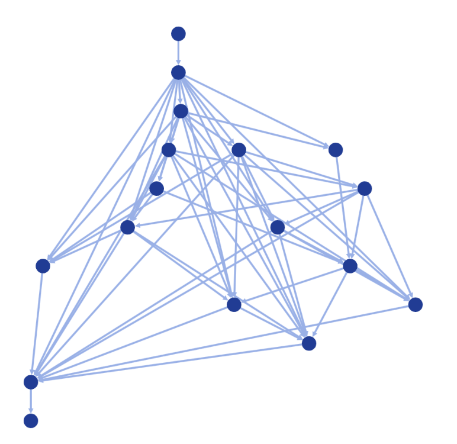
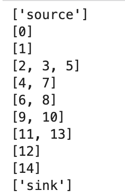

# notebook-network-maximum-parallelism

Experiment modelling maximum parallelism of executors given a DAG of tasks.

This often pops up in computer science / data engineering.

A DAG can represent a "heap" like structure of tasks that can pull the next most important task, respect minimal lineage requirements but allow parallel work to occur. You would have a pool of workers consuming tasks.

The idea is:

> ***How big of a pool do I need given the shape of the DAG?***

This also shows up in project planning, 

> ***Given a Work Breakdown Structure, how many consultants would I need?***

For simplicity we assume each task takes 1 unit of time, each worker is equivalent to each other and can process tasks consistently taking onl 1 unit of time.

If we want to look at the [*Maximum Flow*](https://networkx.org/documentation/stable/reference/algorithms/generated/networkx.algorithms.flow.maximum_flow.html#networkx.algorithms.flow.maximum_flow) of the DAG as well, we will assume all edges have equal capacity of 1.

# Example





With the widest being `3`.

# Google Colab

[](https://colab.research.google.com/github/neozenith/notebook-network-maximum-parallelism/blob/main/notebooks/maximum_parallelism.ipynb)

# Local Jupyter Lab

```sh
poetry config virtualenvs.in-project true
poetry install
poetry run invoke dev
```